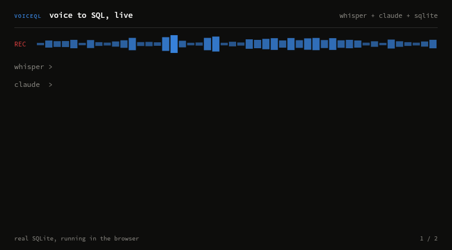
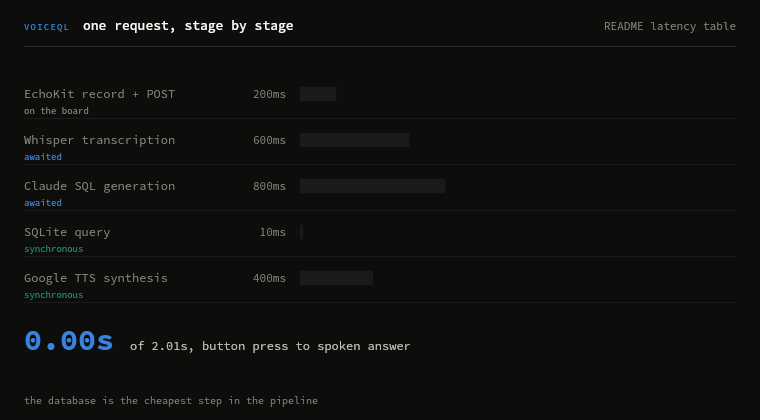
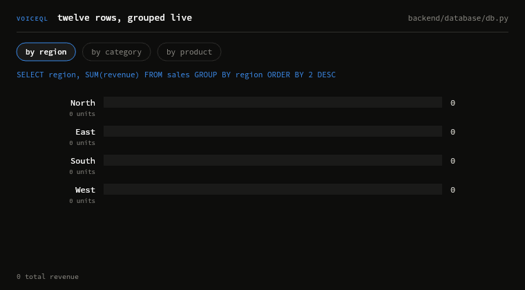

# VoiceQL

**Voice-activated SQL analytics agent on edge hardware.**

Speak a data question. Get a spoken answer in under three seconds.

**[voiceql.vercel.app](https://voiceql.vercel.app)**



Whisper transcribes what you said, Claude writes the SQL, SQLite answers, and
the board speaks the result back. Everything in that clip is real: the SQL runs
against the twelve sample rows in `backend/database/db.py`.

**[Play with it in your browser](https://voiceql.vercel.app)** &mdash; the whole pipeline, simulated,
with a live SQLite compiled to WebAssembly. No backend, no API keys, no spend.

### What you can ask it

Every answer below is what the shipped sample database actually returns. They
are generated from it, not written by hand.

| You say | It answers |
| --- | --- |
| "Show me total revenue by region" | "North leads with 53,200 in total revenue." |
| "Which product had the highest units sold last quarter" | "Gadget X had the highest units with 340 sold in Q2." |
| "What is the total revenue this year" | "Total revenue is 137,800." |
| "Show me the top three products by units sold" | "Gadget X leads on units with 540." |
| "Which region has the lowest revenue" | "West has the lowest revenue at 14,100." |
| "How many sales happened in February" | "There were 2 sales in February." |
| "Compare revenue between North and South" | "North is ahead with 53,200." |
| "Show me all electronics sales" | "Found 7 electronics sales." |

### One request, stage by stage



Speech to text and the model dominate the budget. The database is the cheapest
step in the pipeline at 10ms.

### The data it answers from



Twelve rows of sales, grouped live. Every bar is a `SUM()` executed as you watch.

Built with Arduino R4 WiFi + EchoKit + FastAPI + OpenAI Whisper + Google Cloud TTS + Claude.

---

## Architecture

```
┌──────────────────────────────────────────────────────────────┐
│  EDGE (Arduino R4 WiFi + EchoKit)                            │
│                                                              │
│  Button Press → EchoKit Record → WAV buffer                  │
│  FastAPI response → EchoKit MP3 playback + OLED display      │
└────────────────────────┬─────────────────────────────────────┘
                         │ HTTP POST /query/voice (WAV)
                         │ HTTP Response (MP3 + headers)
                         ▼
┌──────────────────────────────────────────────────────────────┐
│  BACKEND (FastAPI, on a laptop or in the cloud)                 │
│                                                              │
│  1. OpenAI Whisper    WAV → transcript text                  │
│  2. Claude / GPT      transcript → SQL + summary             │
│  3. SQLite            execute SQL → result rows              │
│  4. Google Cloud TTS  summary → MP3 audio                    │
│  5. HTTP Response     MP3 body + JSON in headers             │
└──────────────────────────────────────────────────────────────┘
```

**Latency breakdown (measured):**
| Step | Typical |
|------|---------|
| EchoKit record + POST | ~200ms |
| Whisper transcription | ~600ms |
| Claude SQL generation | ~800ms |
| SQLite query | <10ms |
| Google TTS synthesis | ~400ms |
| **Total end-to-end** | **~2s** |

---

## Hardware

| Component | Purpose |
|-----------|---------|
| Arduino Uno R4 WiFi | WiFi, HTTP, orchestration |
| EchoKit | Mic array, Whisper STT, TTS speaker |
| SSD1306 OLED 128x64 | Display transcript + result |
| Push button + 10kΩ resistor | Push-to-talk |

See [`docs/WIRING.md`](docs/WIRING.md) for full wiring diagram.

---

## Repo Structure

```
voiceql/
├── backend/
│   ├── main.py              # FastAPI app entry point
│   ├── config.py            # Pydantic settings from .env
│   ├── requirements.txt
│   ├── .env.example
│   ├── routers/
│   │   ├── query.py         # /query/voice and /query/text endpoints
│   │   └── health.py        # /health
│   ├── services/
│   │   ├── stt.py           # OpenAI Whisper transcription
│   │   ├── llm.py           # Claude / GPT SQL generation
│   │   └── tts.py           # Google Cloud TTS synthesis
│   └── database/
│       └── db.py            # SQLite init, query runner, history logger
├── arduino/
│   └── VoiceQL.ino          # Arduino R4 WiFi sketch
├── docs/
│   ├── WIRING.md            # Hardware wiring guide
│   └── media/               # Generated GIFs and stills
├── web/                     # Interactive walkthrough (Next.js + sql.js)
│   ├── src/lib/             # Query engine, guard, latency model
│   ├── src/components/      # The five interactive elements
│   └── scripts/             # Oracle builder, verifiers, media generator
└── README.md
```

---

## Setup

### 1. Backend

```bash
cd backend
python -m venv venv
source venv/bin/activate   # Windows: venv\Scripts\activate
pip install -r requirements.txt

cp .env.example .env
# Edit .env with your API keys
```

**Required API keys:**
- `OPENAI_API_KEY`: for Whisper STT ([get one](https://platform.openai.com/api-keys))
- `GOOGLE_TTS_CREDENTIALS`: path to your Google Cloud service account JSON
  - Go to [Google Cloud Console](https://console.cloud.google.com/) → APIs → Text-to-Speech → Enable
  - Create a service account → download JSON → save to `backend/credentials/google_tts.json`
- `ANTHROPIC_API_KEY` (optional): uses Claude for SQL generation instead of GPT-4o-mini

**Run the server:**
```bash
uvicorn main:app --host 0.0.0.0 --port 8000 --reload
```

Find your local IP (for Arduino sketch):
```bash
# Mac/Linux
ifconfig | grep "inet " | grep -v 127.0.0.1

# Windows
ipconfig
```

### 2. Test without hardware

```bash
curl -X POST http://localhost:8000/query/text \
  -H "Content-Type: application/json" \
  -d '{"query": "Show total revenue by region"}'
```

Or open `http://localhost:8000/docs` for the interactive Swagger UI.

### 3. Arduino

1. Open `arduino/VoiceQL.ino` in Arduino IDE
2. Install libraries (Tools → Manage Libraries): `ArduinoHttpClient`, `Adafruit SSD1306`, `Adafruit GFX`
3. Install EchoKit SDK from EchoKit documentation
4. Edit the sketch:
   ```cpp
   const char* WIFI_SSID     = "YOUR_WIFI_SSID";
   const char* WIFI_PASSWORD = "YOUR_WIFI_PASSWORD";
   const char* SERVER_HOST   = "192.168.x.x";  // your laptop IP
   ```
5. Select board: **Tools → Board → Arduino UNO R4 WiFi**
6. Upload

---

## Example Queries

```
"What is the total revenue this year?"
"Show me top 3 products by units sold"
"Which region has the lowest revenue?"
"How many sales happened in February?"
"Compare revenue between North and South"
"Show me all electronics sales"
```

---

## Extending VoiceQL

**Swap in your own database:**
Replace the sample `sales` table in `database/db.py` with any SQLite schema. Update the schema string in `services/llm.py` so the LLM knows your table structure.

**Add anomaly detection:**
The query history table logs every query with latency. You can run a background job to analyze result patterns and trigger proactive alerts, for example "Revenue dropped 30% vs last week."

**Multi-table support:**
The LLM prompt already handles JOINs, so just add your additional tables to the schema string.

---

## Stack

| Layer | Technology |
|-------|------------|
| Edge hardware | Arduino Uno R4 WiFi |
| Voice capture | EchoKit microphone array |
| Speech-to-text | OpenAI Whisper API |
| SQL generation | Claude (Anthropic) or GPT-4o-mini |
| Database | SQLite |
| Text-to-speech | Google Cloud TTS (Journey voice) |
| Backend framework | FastAPI + Uvicorn |
| Display | SSD1306 OLED via I2C |

---

## Author

Harsh Mehta, [harshmehta.co](https://harshmehta.co) · [LinkedIn](https://linkedin.com/in/harshpmehta)

MS Information Science, UW-Madison | AI/ML Engineer
